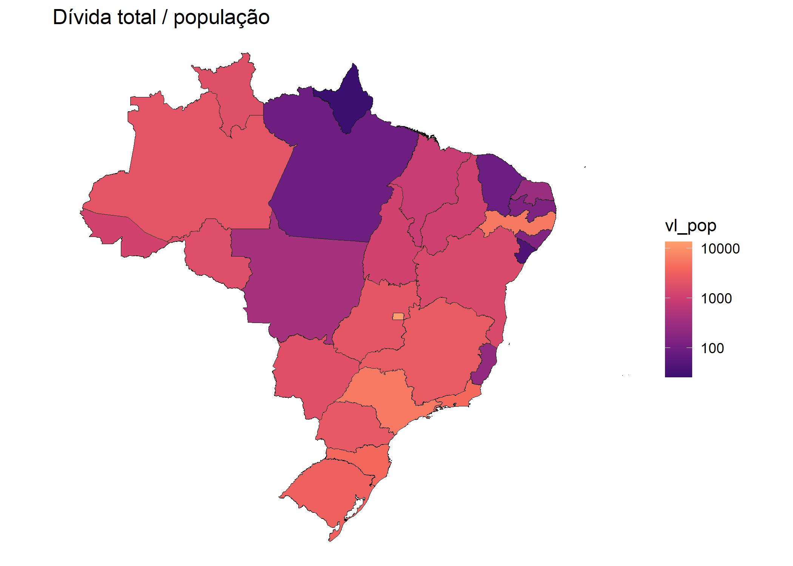
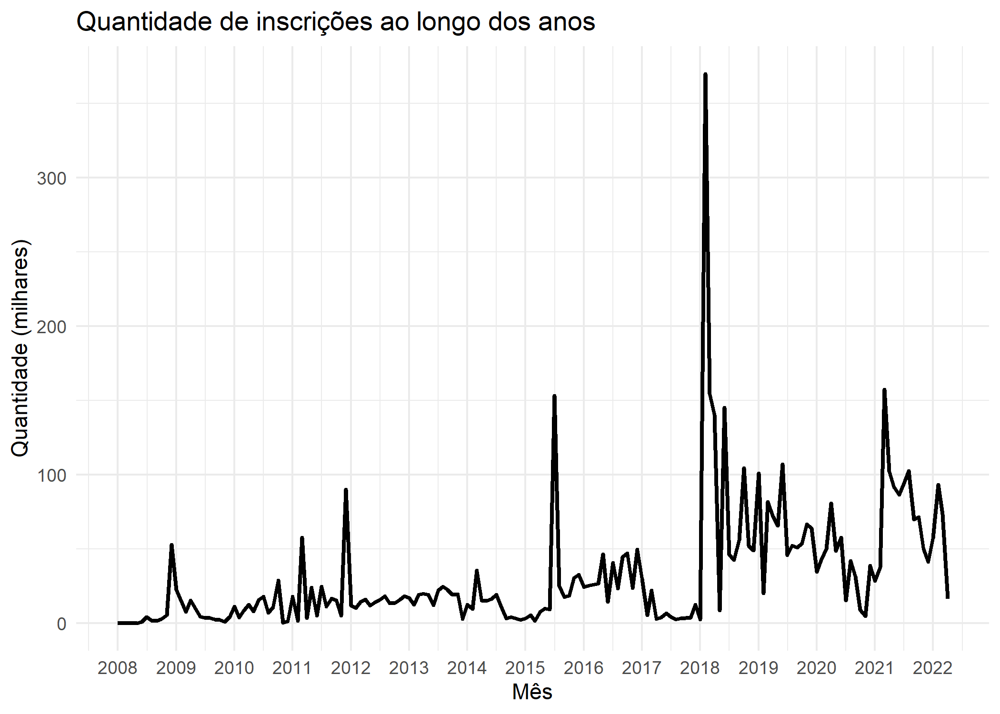
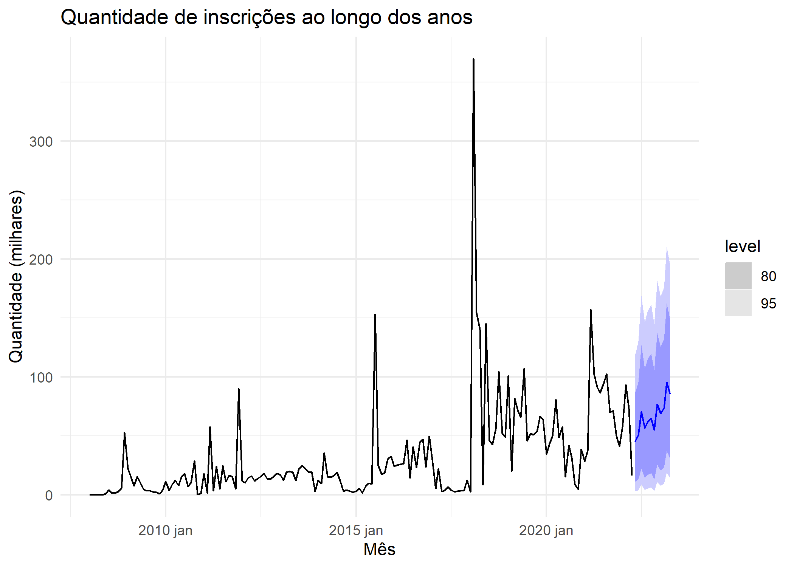

<!-- README.md is generated from README.Rmd. Please edit that file -->

# ibdp

<!-- badges: start -->
<!-- badges: end -->

Materiais da apresentação no Congresso do IBDP.

``` r
# base será colocada nos releases.
pgfn <- readr::read_rds("data-raw/pgfn.rds")
```

## Visualizações

### Tabela

Tipo de crédito

``` r
# tabela
pgfn |>
  count(tipo_credito, sort = TRUE) |>
  mutate(prop = scales::percent(n / sum(n))) |>
  knitr::kable()
```

| tipo_credito                           |       n | prop     |
|:---------------------------------------|--------:|:---------|
| OUTROS                                 | 5838365 | 98.3284% |
| CONTRIBUICAO NAO REPASSADA             |   59766 | 1.0066%  |
| AFERICAO INDIRETA                      |   32093 | 0.5405%  |
| Não Informado                          |    3290 | 0.0554%  |
| SOLIDARIEDADE                          |    1952 | 0.0329%  |
| ARREMATACAO                            |    1138 | 0.0192%  |
| SUCUMBENCIA                            |     583 | 0.0098%  |
| RECLAMATORIA TRABALHISTA JUST TRABALHO |     416 | 0.0070%  |
| NATUREZA NAO PREVIDENCIARIA            |      15 | 0.0003%  |

Situação da inscrição

``` r
pgfn |>
  count(tipo_situacao_inscricao, sort = TRUE) |>
  mutate(prop = scales::percent(n / sum(n))) |>
  knitr::kable()
```

| tipo_situacao_inscricao       |       n | prop    |
|:------------------------------|--------:|:--------|
| Em cobrança                   | 4756355 | 80.105% |
| Benefício Fiscal              | 1165621 | 19.631% |
| Garantia                      |    9556 | 0.161%  |
| Suspenso por decisão judicial |    5093 | 0.086%  |
| Em negociação                 |     993 | 0.017%  |

### Mapa

``` r
# mapa
estados <- geobr::read_state(showProgress = FALSE)
#> Loading required namespace: sf
#> Using year 2010

codigos <- estados |>
  as_tibble() |>
  select(code_state, abbrev_state)

populacao <- abjData::pnud_uf |>
  filter(ano == 2010) |>
  select(code_state = uf, popt) |>
  left_join(codigos, "code_state")


pgfn_uf <- pgfn |>
  group_by(abbrev_state = uf_unidade_responsavel) |>
  summarise(
    n = n(),
    valor = sum(valor_consolidado)
  ) |>
  left_join(populacao, "abbrev_state") |>
  mutate(
    n_pop = n / popt,
    vl_pop = valor / popt
  )

estados |>
  left_join(pgfn_uf, c("abbrev_state")) |>
  ggplot() +
  geom_sf(aes(fill = vl_pop), color = "black", size = .1) +
  scale_fill_viridis_c(
    begin = .2, end = .8,
    option = "A", trans = "log10"
  ) +
  theme_void() +
  labs(
    title = "Dívida total / população"
  )
```



### No tempo

``` r
pgfn_mes <- pgfn |>
  mutate(data = lubridate::floor_date(data_inscricao, "month")) |>
  filter(data >= "2008-01-01") |>
  count(data)

pgfn_mes |>
  ggplot(aes(x = data, y = n/1e3)) +
  geom_line(size = 1) +
  theme_minimal() +
  scale_x_date(date_breaks = "1 year", date_labels = "%Y") +
  labs(
    x = "Mês", y = "Quantidade (milhares)",
    title = "Quantidade de inscrições ao longo dos anos"
  )
```



## Modelo

``` r

library(tsibble)
#> 
#> Attaching package: 'tsibble'
#> The following objects are masked from 'package:base':
#> 
#>     intersect, setdiff, union
library(fable)
#> Carregando pacotes exigidos: fabletools


pgfn_tsibble <- pgfn_mes |>
  mutate(data = yearmonth(data), n = sqrt(n/1e3)) |>
  as_tsibble(index = data)

fit <- pgfn_tsibble |>
  model(
    model = ARIMA(n ~ pdq(2,1,2) + PDQ(1,1,1))
  )

fit |>
  forecast(h = 12) |>
  mutate(.mean = (.mean^2), n = (n^2)) |>
  autoplot(pgfn_tsibble |> mutate(n = (n^2))) +
  theme_minimal() +
  labs(
    x = "Mês",
    y = "Quantidade (milhares)",
    title = "Quantidade de inscrições ao longo dos anos"
  )
```



## Apresentação

Link da apresentação
[aqui](https://docs.google.com/presentation/d/1sFtU7FqHGEV7OOjBLaGT7dh5WQNL3EhuMOAf_p6y3zY/edit?usp=sharing).
